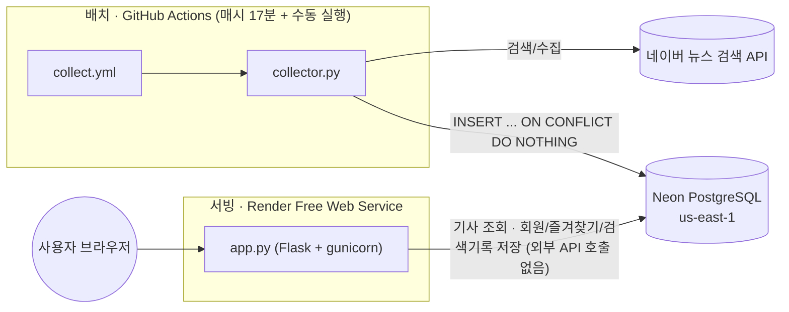

# NewsHub (newsletter-summary-rebuild)

네이버 뉴스 검색 API 기반 뉴스 큐레이션 웹앱. 졸업작품을 다시 구현하며,
"화려한 기능"보다 **DB 설계 · 배치/서빙 분리 · 배포 운영**을 중심으로
정리한 프로젝트입니다.

**배포 주소**: https://newsletter-summary-rebuild.onrender.com
(Render 무료 인스턴스라 15분간 요청이 없으면 슬립 상태가 되고,
다음 요청에서 콜드스타트로 수십 초 걸릴 수 있습니다.)

---

## 1. 문제 정의

초기 버전은 사용자가 검색할 때마다 네이버 API를 직접 호출하는 구조였습니다.
이 구조는 두 가지 문제가 있었습니다.

- API가 느려지거나 장애가 나면 그대로 사용자 응답 지연으로 이어진다.
- 같은 키워드를 여러 사용자가 검색해도 매번 API를 다시 호출한다(캐싱 없음).

그래서 **수집(배치)과 서빙(웹)을 분리**하고, 그 과정에서 SQLite → PostgreSQL
전환, 인덱스 설계, 무료 인프라로 배포하는 과정까지 정리했습니다.

## 2. 시스템 구조



웹 서버(`app.py`)는 요청을 처리하는 동안 외부 API를 호출하지 않습니다.
기사(`articles`)는 조회만 하고, DB에 쓰는 것은 회원가입·즐겨찾기·검색 기록뿐입니다.
기사 수집은 `collector.py`가 전담하고, GitHub Actions가 주기적으로(또는 수동으로)
실행시켜 줍니다.

| 파일 | 역할 |
|---|---|
| `app.py` | 웹 서버. 외부 API 호출 없음(기사는 조회만) |
| `db.py` | Postgres 커넥션 풀 + 스키마 정의 |
| `naver_client.py` | 네이버 API 클라이언트 (재시도 포함) |
| `collector.py` | 배치 수집기. 카테고리/인기 검색어/미수집 검색어를 수집 |
| `benchmark_search.py` | 인덱스 효과를 같은 절차로 다시 측정하는 벤치마크 스크립트 |
| `.github/workflows/collect.yml` | 수집기 스케줄 실행 (매시 17분, 동시 실행 방지) |
| `migrations/` | 운영 DB에 직접 적용한 스키마 변경 SQL |

## 3. 기술 선택 이유

- **Flask**: 1인 프로젝트 규모에 맞는 최소 구성. MSA나 별도 프레임워크는
  불필요하다고 판단.
- **PostgreSQL (Neon)**: SQLite는 동시 쓰기에 약하고, 무료 인프라에서
  "운영 중인 DB"를 다뤄본 경험을 보여주기 어렵다고 판단해 전환. 리전 선택
  과정은 아래 트러블슈팅 5.9 참고.
- **psycopg2 커넥션 풀**: Neon 같은 서버리스 Postgres는 커넥션을 새로
  맺는 비용이 상대적으로 크다. 매 요청마다 새로 연결하지 않고 풀에서
  재사용.
- **pg_trgm**: 한글 부분 문자열 검색 가속(트러블슈팅 5.3, 5.4 참고).
- **kiwipiepy**: 한국어 형태소 분석 기반 명사 키워드 추출(워드클라우드/
  키워드 관계도용).
- **GitHub Actions**: Render 무료 플랜에 Cron Job/Background Worker가
  없어서, 수집 배치의 스케줄러 역할을 대신함(무료).
- **gunicorn**: Flask 개발 서버 대신 운영용 WSGI 서버.

## 4. 주요 기능

- 뉴스 검색 / 카테고리별 열람 (수집된 기사 조회, API 직접 호출 없음)
- 회원가입 / 로그인 (werkzeug 비밀번호 해싱, 입력 규칙 검사, CSRF 토큰)
- 즐겨찾기 추가/삭제
- 검색어 자동완성, 인기 검색어
- 개인 검색 기록 기반 관심 키워드 분석 및 뉴스 추천, 검색 기록 직접 삭제
- kiwipiepy 형태소 분석 기반 키워드 추출 → 워드클라우드, networkx 키워드
  공출현 네트워크 시각화 (기본은 배포 환경에서 꺼져 있음, 5.6 참고)

## 5. 트러블슈팅

### 5.1 실시간 API 호출 → 사전 수집 구조 전환

**문제**: 검색할 때마다 네이버 API를 호출해서, API 장애/지연이 그대로
사용자 응답 지연이 되고 같은 키워드도 매번 다시 호출했다.

**해결**: `collector.py`가 고정 카테고리(스포츠/연예/경제/IT/사회/
생활문화) + 인기 검색어 + 아직 한 번도 수집되지 않은 검색어를 주기적으로
수집해 `articles` 테이블에 적재하고, 웹 서버는 이 테이블만 조회한다.
중복 기사는 `articles.link UNIQUE` 제약 + `INSERT ... ON CONFLICT (link)
DO NOTHING` 한 줄로 걸러낸다 — 애플리케이션 코드가 아니라 DB 제약으로
정합성을 보장한다.

**수치**:
- 파이프라인 개발 초기(SQLite)에 동일 배치를 곧바로 재실행해서 멱등성을
  검증: 12개 키워드 전부 `신규 0건 / 중복 20건`으로, 재수집해도 DB에
  중복이 쌓이지 않음을 확인 (`UNIQUE(link)` + `INSERT OR IGNORE`)
- Postgres 전환 후 실제 운영 로그(같은 배치 안에서 카테고리 간 교차
  중복 제거 사례): `연예 조회 20건 / 신규 19건 / 중복 1건`,
  `사회 조회 20건 / 신규 18건 / 중복 2건` — 다른 카테고리 키워드로
  검색해도 이미 수집된 기사면 `ON CONFLICT (link) DO NOTHING`으로
  자동으로 걸러짐

### 5.2 SQLite → PostgreSQL 전환 시 NULL 정렬 기본값 차이

**문제**: 기사 목록을 `ORDER BY published_at DESC`로 정렬하는데,
SQLite에서 Postgres로 옮기자 날짜 파싱에 실패한(= `published_at`이
NULL인) 기사가 최신순 목록 맨 위에 뜨는 문제가 생겼다.

**원인**: SQLite와 Postgres는 `ORDER BY ... DESC`에서 NULL을 반대로
취급한다. Postgres는 기본적으로 NULL을 "가장 큰 값"으로 보기 때문에
DESC 정렬에서 NULL이 맨 앞으로 온다(SQLite는 반대로 맨 뒤).

**해결**: 정렬 조건에 `NULLS LAST`를 명시적으로 추가
(`ORDER BY published_at DESC NULLS LAST`). 두 DB 엔진 간 방언 차이를
실제로 재현/확인하고 고친 사례.

**후속 조치**: 목록 인덱스는 `published_at DESC`로 만들어져 있었는데,
DESC 인덱스의 기본 NULL 위치는 `NULLS FIRST`라서 쿼리의 정렬 순서와
맞지 않았다. 인덱스도 `DESC NULLS LAST`로 다시 만들어 쿼리와 일치시켰다
(`migrations/2026-09_index_nulls_last.sql`).

### 5.3 트라이그램 GIN 인덱스로 검색 속도 개선 (128.7ms → 0.99ms)

**문제**: `WHERE title ILIKE '%keyword%' OR content ILIKE '%keyword%'`
검색이 항상 Seq Scan(전체 테이블 스캔)으로 실행된다. 와일드카드가
문자열 앞에 붙어서 일반 B-tree 인덱스로는 가속할 수 없다.

**해결**: `pg_trgm` 확장의 GIN 트라이그램 인덱스를 `title`, `content`
컬럼에 적용. 문자열을 3글자 단위로 쪼개 인덱싱하기 때문에, 기존 `ILIKE
'%keyword%'` 쿼리 문법을 그대로 유지하면서 인덱스를 타게 만들 수 있다.

**측정 방법**: 실제 수집 데이터(수백 건)로는 차이가 거의 안 보여서,
`benchmark_search.py`로 `category='벤치마크'` 더미 기사 10만 건을 만들고
(검색어 "반도체" 포함 비율 0.5%로 설정해 선택도를 현실적으로 맞춤),
인덱스를 껐다 켜며 `EXPLAIN (ANALYZE, BUFFERS)`로 같은 쿼리를 비교했다.
측정 후 더미 데이터는 삭제해서 실제 데이터와 섞이지 않게 했다
(측정 절차는 8번 "실행 방법" 참고).

**수치**:

| | 실행 계획 | 실행 시간 |
|---|---|---|
| BEFORE | Seq Scan (10만 건 중 99,613건을 훑고 버림) | **128.708 ms** |
| AFTER | Bitmap Heap Scan (`BitmapOr`로 title/content 트라이그램 인덱스 결합) | **0.991 ms** |

약 **130배** 개선. AFTER 실행계획에는 `Bitmap Index Scan on
idx_articles_title_trgm` / `idx_articles_content_trgm`이 명시적으로
찍힌다 — 인덱스가 실제로 사용됐다는 것을 실행계획으로 확인.
(이 수치는 목록 정렬 인덱스가 아직 `published_at DESC`, 즉 기본값인
`NULLS FIRST`로 되어 있던 옛 스키마 상태에서, 검색어 하나로 각각
1회씩만 측정한 결과다. 아래 "추가 발견"은 5.2 후속 조치로 정렬
인덱스를 `NULLS LAST`로 바꾼 뒤 같은 벤치마크를 다시 돌려서 나온
결과다.)

**한계와 보완**: 위 수치는 3글자이면서 드물게 등장하는 검색어라는 인덱스에
유리한 조건에서 각 1회 측정한 결과다. 한 번만 재면 캐시 상태에 따라 결과가
흔들리므로, 현재 스크립트는 난수 시드를 고정하고 측정 전에 `ANALYZE`로 통계를
갱신한 뒤, 조건마다 워밍업 1회 후 5회 실행한 중앙값을 비교하도록 바꿨다.
또 트라이그램은 2글자 이하 검색어에는 효과가 거의 없고, 흔한 단어는 후보가
많아 플래너가 전체 스캔을 고를 수 있다.

**추가 발견 (정렬 인덱스를 NULLS LAST로 바꾼 뒤 재측정)**: 5.2 후속 조치로
목록 정렬 인덱스를 `published_at DESC NULLS LAST`로 바꾸자, 이 인덱스의
정렬 순서가 검색 쿼리의 `ORDER BY published_at DESC NULLS LAST LIMIT 10`과
정확히 일치하게 됐다. 그러면 플래너가 트라이그램 대신 **이 정렬 인덱스를
처음부터 훑다가 LIMIT 10을 채우는 순간 멈추는 전략**을 쓸 수 있어서, 검색어의
실제 등장 빈도에 따라 트라이그램의 이득이 크게 달라진다. 더미 기사에도
`published_at`을 최근 30일 안에서 채워 넣도록 `benchmark_search.py`를
고치고, 선택도가 다른 세 검색어로 같은 방식(더미 10만 건, 시드 고정,
`ANALYZE` 후 워밍업 1회 + 5회 중앙값)으로 다시 측정했다:

| 검색어 | 선택도 | BEFORE(트라이그램 없음) | AFTER(트라이그램 적용) | 개선 |
|---|---|---|---|---|
| `벤치희귀어`(실제 기사엔 없는 조어) | 0.01%(더미 중 11건) | Seq Scan, 101,078행 전부 훑음, **127.451 ms** | Bitmap Heap Scan, 11행만 확인, **0.105 ms** | 약 **1,214배** |
| `존재하지않는검색어` | 0건 | Seq Scan, 101,078행 전부 훑음, **162.161 ms** | Bitmap Heap Scan, 0행, **0.084 ms** | 약 **1,931배** |
| `반도체` | 0.5%(더미 중 약 500건 + 실제 기사) | 같은 데이터로 두 번 측정했더니 서로 다른 계획이 나왔다: 1회차 Seq Scan **128.645 ms**, 2회차(재측정) 정렬 인덱스 Index Scan(1,631행 훑음) **3.783 ms** | 1회차 Bitmap Heap Scan **1.146 ms**(약 112배 개선), 2회차 AFTER도 똑같이 정렬 인덱스 Index Scan **3.757 ms**(개선 없음) | 1회차 약 112배 / 2회차 약 1.0배 |

**해석**: 검색어가 드물거나(`벤치희귀어`) 아예 결과가 없으면
(`존재하지않는검색어`), 정렬 인덱스를 처음부터 훑어도 LIMIT 10을 채울 수
없어 결국 테이블 전체(101,078행)를 다 봐야 한다 — 이런 경우 트라이그램은
여전히 압도적으로 빠르다. 반면 검색어가 흔하면(`반도체`) 정렬 순서대로
훑다가 이른 시점에 LIMIT을 채우고 멈출 수 있어서 트라이그램 없이도 빠를
여지가 있다. 다만 `반도체` 재측정에서 같은 데이터로도 플래너가 매번 같은
계획을 고르지는 않았다 — 추정 행 수(플래너는 ILIKE 선택도를 세 검색어
모두 "약 20행"으로 똑같이 추정한다)가 아니라 통계 샘플링에 따라 달라지는
다른 비용 요소(정렬 인덱스 스캔의 상관관계 추정 등)가 경계선에 있는
것으로 보인다. 즉 "흔한 검색어는 트라이그램이 필요 없다"고 단정할 수는
없고, 이번 측정에서는 그 판단이 오락가락했다는 사실만 확인했다.

### 5.4 한국어 검색에 전문검색(to_tsvector) 대신 트라이그램을 쓴 이유

**문제**: Postgres 기본 전문검색(`to_tsvector`)이 한국어에 적합한지
검토가 필요했다.

**원인**: Postgres의 기본 텍스트 검색 설정(`simple`, `english`)은
공백/구두점 기준으로만 토큰을 나눈다. 한국어는 조사·어미가 단어에 그대로
붙는 교착어라("반도체가", "반도체는", "반도체를"이 전부 다른 토큰으로
인식됨), 형태소 분석 없이 공백 기준 토큰화만으로는 검색이 제대로 안 된다.
Neon 같은 관리형 Postgres에는 한국어 형태소 분석 확장이 기본으로 없다.

**해결**: 토큰화 없이 문자열 자체를 3글자 단위로 인덱싱하는 `pg_trgm`을
선택했다. 언어와 무관하게 부분 문자열 일치를 가속할 수 있어서, 기존
`ILIKE '%keyword%'` 검색 의미를 바꾸지 않고 인덱스만 추가하면 됐다.
(트레이드오프: "먹었다"와 "먹다"처럼 어간이 같은 단어를 같은 결과로
묶어주는 형태소 기반 검색은 못 한다. 이 프로젝트의 검색은 단순 키워드
포함 여부만 판단하면 되므로 허용 가능한 트레이드오프로 판단.)

### 5.5 폰트 경로 하드코딩으로 배포 환경에서 한글이 깨지는 문제

**문제**: 워드클라우드/키워드 관계도 생성 코드가 아래처럼 OS별 폰트
경로를 하드코딩하고 있었다.

```python
font_candidates = [
    "C:/Windows/Fonts/malgun.ttf",
    "/usr/share/fonts/truetype/nanum/NanumGothic.ttf",
    "/usr/share/fonts/truetype/noto/NotoSansCJK-Regular.ttc",
]
```

**원인**: 로컬 개발 환경(Windows)에는 `malgun.ttf`가 있어서 문제없이
동작했지만, Render 배포 컨테이너에는 이 경로들에 한글 폰트가 전혀 없다.
로컬 테스트만으로는 드러나지 않고, 실제 배포 환경에서만 나타나는
전형적인 "환경 의존적 버그"였다.

**해결**: 재배포 가능한 라이선스(SIL OFL)의 나눔고딕 폰트 파일을
`static/fonts/`에 직접 커밋해서, 어떤 환경에서 실행되든 같은 폰트를
쓰도록 했다. OS 경로를 추측하는 대신 저장소에 포함된 파일을 참조하므로
로컬/배포 환경 차이가 없어진다.

### 5.6 무료 인스턴스(512MB)에서 시각화를 켜자 재시작이 반복된 문제

**문제**: 폰트 문제를 고치고 `ENABLE_VISUALIZATIONS=true`로 재배포한
직후, 사이트 접속 시 HTTP 503이 발생했다.

**관측된 사실** (Render Logs):
- 시각화를 끈 상태(평소)의 메모리 사용량은 142MB / 512MB
- 재배포 후 다음 로그 패턴이 약 53~61초 간격으로 3회 이상 반복 관측됨
  (01:10:17, 01:11:10, 01:12:11):

  ```
  ==> Running 'gunicorn app:app'
  [INFO] Starting gunicorn 26.2.0
  [INFO] Listening at: http://0.0.0.0:10000
  [INFO] Using worker: sync
  [INFO] Booting worker with pid: 41
  ==> No open HTTP ports detected on 0.0.0.0, continuing to scan...
  ```

  즉 워커가 부팅된 직후 Render가 포트를 열린 상태로 감지하지 못하고,
  계속 스캔하다가 다시 `Running 'gunicorn app:app'`부터 반복하는
  패턴이었다. 로그에 "Out of memory" 같은 명시적 문구는 없었다.

**원인 (추정)**: 시각화가 켜지면 첫 `/` 요청에서 `home()`이 처음으로
`matplotlib`/`wordcloud`/`networkx`/`kiwipiepy`를 임포트하고 이미지를
생성한다. 이 무거운 라이브러리들을 한꺼번에 처음 로드·실행하는 과정에서
메모리 사용량이 급증했거나, gunicorn 워커의 기본 제한 시간(30초)을
넘겨 워커가 재시작됐을 가능성이 있다. 로그만으로는 OOM인지 타임아웃인지
확정할 수 없었다.

**해결**: `ENABLE_VISUALIZATIONS`를 다시 `false`로 되돌리자 즉시
정상 복구됐다. 이 환경변수는 코드 변경 없이 Render 대시보드에서
바로 껐다 켤 수 있도록 원래부터 설계돼 있었고, 실제로 문제가 생겼을 때
그 설계가 그대로 안전장치 역할을 했다. 현재 배포 환경에서는
`ENABLE_VISUALIZATIONS=false`로 운영 중이며, 로컬 개발 환경에서는
계속 켜서 확인할 수 있다. 근본적으로는 무거운 시각화를 요청 처리 중이
아니라 배치에서 미리 생성하는 구조가 맞다고 본다.

**함께 고친 점**: 이미지를 `static/wordcloud.png`처럼 고정 파일에 저장하면
동시에 들어온 요청이 서로의 이미지를 덮어쓴다. 파일로 저장하지 않고 메모리에서
PNG를 만들어 data URI로 페이지에 넣도록 바꿨다.

### 5.7 검색 결과가 없을 때의 사용자 경험 문제

**문제**: "수집된 데이터만 조회"하는 구조로 바뀌면서, 아직 수집되지 않은
키워드를 검색하면 실제로는 "존재하지 않는 뉴스"가 아니라 "아직 수집
안 된 것"인데도 "검색 결과가 없습니다"라는 동일한 문구가 떴다. 사용자
입장에서는 이 서비스에 해당 키워드 자체가 없다고 오해할 수 있다.

**해결**:
1. `search_keywords`에 `last_collected_at` 컬럼을 추가해서, 이 값이
   NULL인(한 번도 수집된 적 없는) 검색어는 인기 순위와 무관하게 다음
   배치에서 반드시 수집 대상에 포함되도록 했다. 즉 "검색하면 최소
   1회는 수집이 보장된다." 다만 한 배치에 신규 키워드가 몰릴 경우
   API 호출이 급증하지 않도록 배치당 처리 개수에 상한(20개)을 뒀다.
2. 결과가 0건일 때 `last_collected_at`을 확인해 문구를 나눴다. 아직
   수집 전이면 "아직 수집되지 않은 키워드입니다. 다음 수집 때
   반영됩니다", 수집했는데도 기사가 없으면 "검색 결과가 없습니다".

### 5.8 정규화 범위를 어디까지 할지 판단 (M:N 태그 테이블을 쓰지 않은 이유)

**고민**: 기사 하나가 여러 키워드(카테고리) 검색에 동시에 걸릴 수
있는데, `articles.category`는 컬럼 하나뿐이라 실제로는 가장 먼저
수집한 카테고리만 남는다. 완전히 정규화하려면 `article_categories`
같은 M:N 중간 테이블이 필요하다.

**판단**: 이번 프로젝트의 검색 기능(`WHERE title ILIKE ... OR content
ILIKE ...`)은 애초에 카테고리와 무관하게 동작하고, `category`는 상단
네비게이션 메뉴(스포츠/경제 등) 필터링에만 쓰인다. 즉 정규화를 안 해서
생기는 영향은 "같은 기사가 여러 카테고리 메뉴에 동시에 노출되지 않는다"
정도이고, 검색 정확도에는 영향이 없다. M:N 테이블을 추가하면 카테고리
목록 조회마다 JOIN이 필요해지는데, 실제 읽기 패턴이 그 복잡도를
정당화하지 못한다고 판단해 단일 컬럼으로 유지했다. (완전한 정규화가
항상 정답은 아니고, 실제 쿼리 패턴 기준으로 판단해야 한다는 근거로
설명 가능한 지점.)

### 5.9 Neon과 Render의 리전 불일치

**문제**: Neon 프로젝트를 처음 만들 때 싱가포르(ap-southeast-1)로
만들었는데, 이미 배포돼 있던 Render 웹 서비스는 버지니아(Virginia,
US East) 리전이었다. 모든 요청마다 DB 왕복이 지구 반대편을 오가는
구조였다.

**원인 확인**: Neon은 프로젝트 생성 후 리전을 변경할 수 없고(공식
FAQ), 리전을 바꾸려면 새 프로젝트를 만들어 데이터를 옮기는 방법뿐이다.

**해결**: Neon의 `aws-us-east-1`(N. Virginia) 리전에 새 프로젝트를
생성해 Render의 Virginia 리전과 물리적으로 같은 곳에 두었다. 기존
싱가포르 프로젝트에는 테스트성 데이터만 있어서(마이그레이션 없이)
새 스키마를 그대로 적용하고 `collector.py`로 다시 채우는 쪽을
선택했다 — 데이터 가치보다 마이그레이션 비용이 더 크다고 판단.

### 5.10 하드코딩된 FLASK_SECRET_KEY 보안 문제

**문제**: `app.secret_key`가 환경변수로 안 넘어오면 코드에 박힌 기본값
(`"newshub_development_secret_key"`)으로 폴백하도록 돼 있었다. 이
저장소는 public이라 이 기본값이 GitHub에 그대로 공개돼 있다.

**원인**: Flask의 `secret_key`는 세션 쿠키 서명에 쓰인다. 이 값을 알면
로그인 세션 쿠키를 위조할 수 있어서, public 저장소에 기본값이 노출된
채로 운영하면 실제 사용자 계정(비밀번호 해시가 Postgres에 저장됨)이
위협받을 수 있는 실질적인 보안 문제다.

**해결**:
1. `secrets.token_hex(32)`로 무작위 시크릿 키를 생성해 Render
   환경변수(`FLASK_SECRET_KEY`)에만 설정하고, 코드에는 커밋하지 않았다.
2. 환경변수가 실수로 빠져도 공개된 값으로 조용히 동작하지 않도록,
   운영 환경(Render)에서는 키가 없으면 앱이 시작되지 않게 바꿨다.
   `db.py`가 `DATABASE_URL`이 없으면 바로 멈추는 것과 같은 원칙이다.
   로컬 개발에서만 임시 값을 허용한다.

### 5.11 웹 서버에도 "DB 제약으로 정합성 보장" 원칙 적용

**문제**: 수집기는 `ON CONFLICT`로 중복 판단을 DB에 맡겼지만, 웹 서버의
검색 기록·회원가입은 "SELECT로 먼저 확인 → 없으면 INSERT" 구조였다.
같은 새 검색어나 같은 아이디가 동시에 들어오면 두 요청이 모두 "없음"을
보고 INSERT를 시도해, 한쪽이 UNIQUE 제약 위반 오류를 받는다. 또 모든
라우트가 마지막 줄에서만 커넥션을 반납해서, 중간에 예외가 나면
커넥션이 풀로 돌아오지 않았다(최대 10개가 고갈되면 서비스 전체 중단).

**해결**:
- 검색 기록은 `INSERT ... ON CONFLICT ... DO UPDATE SET count = count + 1`
  upsert 한 문장으로, 회원가입은 `ON CONFLICT (username) DO NOTHING` 후
  삽입된 행 수로 중복을 판단(중복 시 409)하도록 바꿨다.
- `db.connection()` 컨텍스트 매니저를 만들어 `with` 문 안에서만
  커넥션을 쓰고, 예외가 나도 `finally`에서 롤백·반납되게 했다.
- 즐겨찾기는 브라우저가 hidden 필드로 보낸 기사 정보를 그대로 저장하던
  방식을 없애고, URL의 기사 ID로 서버의 `articles`에서 직접 조회한 값만
  저장하도록 바꿨다(클라이언트가 보낸 값은 조작될 수 있음).

### 5.12 웹 보안 점검 후 보완

코드를 다시 검토하며 요청 위조, 입력값, 세션 관련 항목을 점검하고 보완했다.

| 점검 항목 | 문제 | 보완 |
|---|---|---|
| CSRF | 상태를 바꾸는 POST 폼에 토큰이 없어, 다른 사이트가 로그인한 사용자 브라우저로 요청을 보내게 만들 수 있었다 | 세션별 토큰을 모든 POST 폼에 넣고 `before_request`에서 검사(`hmac.compare_digest`) |
| 세션 쿠키 | SameSite·Secure를 브라우저 기본값에 맡겼다 | `SameSite=Lax`, 운영(HTTPS)에서 `Secure`, `HttpOnly` 명시 |
| 로그아웃 | GET이라 ``만으로 강제 로그아웃 가능 | POST로만 처리, `session.clear()` |
| 입력 규칙 | 한 글자 비밀번호, 공백·특수문자 아이디 허용. 오류가 빈 화면의 텍스트로만 표시 | 서버에서 아이디(영문·숫자·밑줄 4~20자)·비밀번호(8자 이상) 검사, 오류를 폼 화면에 표시(400/401/409) |
| LIKE 패턴 | 검색어의 `%`, `_`가 와일드카드로 해석되어 `%` 검색이 전체 기사와 일치 | 이스케이프 후 `ESCAPE '\'` 명시 |
| 리다이렉트 | 즐겨찾기 후 Referer 헤더의 주소로 이동해 외부 사이트로 튕길 수 있었다 | 같은 호스트일 때만 이동 |
| 링크 출력 | 즐겨찾기 화면이 저장된 링크를 그대로 `href`에 넣었다 | `http://`, `https://` 주소만 링크로 표시 |
| 개인정보 | 개인 검색 기록을 사용자가 지울 방법이 없었다 | 프로필에서 내 검색 기록 삭제 기능 제공 |

### 5.13 배치 운영 안정성 보완

- **스케줄 시각**: GitHub Actions의 스케줄은 부하가 몰리는 정각에 지연·누락될
  수 있어 매시 17분으로 옮겼다.
- **동시 실행 방지**: 수동 실행과 스케줄 실행이 겹치면 수집기가 두 개 돌아
  API 호출이 두 배가 된다. 기사 중복은 DB 제약이 막지만 호출 낭비를 막기 위해
  `concurrency` 그룹으로 한 번에 하나만 실행되게 했다.
- **DB 오류 격리**: 예전에는 API 오류만 키워드 단위로 격리해서, 한 키워드를
  저장하다 DB 오류가 나면 배치 전체가 멈췄다. 키워드 단위 DB 오류도 롤백 후
  `collection_logs`에 실패로 남기고 다음 키워드로 넘어가게 했다.

### 남아 있는 한계

- `favorites`, `user_search_keywords`가 `users.id` 외래 키 대신 `username`
  문자열로 연결되고, 즐겨찾기가 기사 내용을 복사해 저장한다. `article_id`,
  `user_id` 외래 키 구조가 맞지만, 기사 테이블에 없는 예전 즐겨찾기 데이터가
  있어 운영 데이터 이전 계획을 세운 뒤 적용할 예정이다.
- 로그인 시도 횟수 제한이 없다(요청 제한 라이브러리와 저장소 필요).
- 의존성 버전이 고정되어 있지 않고, 자동 테스트가 없다.

## 6. 데이터베이스

- **엔진**: PostgreSQL (Neon, `aws-us-east-1`)
- **주요 테이블**: `users`, `articles`, `search_keywords`,
  `user_search_keywords`, `favorites`, `collection_logs`
- **인덱스**:
  - `articles(category, published_at DESC NULLS LAST)` — 카테고리별 최신순 목록
  - `articles(published_at DESC NULLS LAST)` — 전체 최신순 목록
  - `articles USING GIN (title gin_trgm_ops)`,
    `articles USING GIN (content gin_trgm_ops)` — 검색 가속(5.3, 5.4)
- **커넥션 관리**: `psycopg2.pool.ThreadedConnectionPool` (요청마다
  새로 연결하지 않고 재사용, `with db.connection()`으로 반드시 반납)

## 7. 배포 구성

| 구성 요소 | 서비스 | 비고 |
|---|---|---|
| 웹 서버 | Render Free Web Service | 15분 무활동 시 슬립, 콜드스타트 있음. Python 3.13(`.python-version`으로 고정) |
| DB | Neon PostgreSQL (Free) | `aws-us-east-1`, Render와 같은 리전 |
| 배치 수집기 | GitHub Actions | `.github/workflows/collect.yml`, 매시 17분 + 수동 실행(`workflow_dispatch`), 동시 실행 방지. Python 3.13 |

Render 무료 플랜은 Cron Job(분당 과금 + 최소 월 $1)과 Background
Worker(월 $7~)가 유료 전용이라, 수집 배치는 대신 GitHub Actions
스케줄 워크플로우로 돌린다. 이 저장소가 public이라 Actions 실행
시간은 무료다. 웹 서비스와 완전히 분리돼 있어서, 웹 서비스가 슬립
상태여도 수집은 그대로 진행된다.

Render는 서비스 생성 시점의 기본 Python 버전을 그대로 쓰기 때문에(예:
새로 만든 서비스는 3.14.3), 별도로 지정하지 않으면 GitHub Actions
(`python-version: "3.13"`)와 실제 배포 환경의 Python 버전이 달라질 수
있다. 저장소 루트의 `.python-version` 파일에 `3.13`을 지정해 Render가
Actions·로컬 테스트 환경과 같은 마이너 버전을 쓰도록 맞췄다.

## 8. 실행 방법

### 로컬 개발

```bash
git clone https://github.com/arongi27/newsletter-summary-rebuild.git
cd newsletter-summary-rebuild
pip install -r requirements.txt
```

`.env` 파일 생성:

```
NAVER_CLIENT_ID=...
NAVER_CLIENT_SECRET=...
DATABASE_URL=postgresql://...
FLASK_SECRET_KEY=...
```

```bash
python collector.py   # DB에 기사 채우기 (최초 1회, 스키마도 자동 생성)
python app.py          # http://127.0.0.1:5000
```

### 배치 수집기만 실행

```bash
python collector.py                                  # 1회 실행 (Actions가 호출하는 방식)
python collector.py --loop --interval-minutes 10      # 로컬 데모용 반복 실행
```

CI(GitHub Actions)에서는 웹 서버 의존성(Flask, kiwipiepy, matplotlib 등)
없이 `requirements-collector.txt`(requests, python-dotenv,
psycopg2-binary)만 설치해서 더 가볍게 실행한다.

### 인덱스 효과 측정 (5.3 트러블슈팅)

벤치마크는 트라이그램 인덱스를 삭제했다가 다시 만들고, 측정 중에는 더미
기사가 검색 결과에 섞일 수 있으므로 **서비스 중인 DB가 아니라 Neon 브랜치
같은 분리된 DB**에서 실행한다. 더미 데이터는 난수 시드가 고정되어 있어
매번 같은 데이터가 생성되고, 비교는 워밍업 후 5회 실행한 중앙값으로 한다.

```bash
python benchmark_search.py --seed 100000   # 더미 기사 10만 건 생성
python benchmark_search.py --run 반도체     # before/after 실행계획·시간 비교
python benchmark_search.py --cleanup       # 더미 데이터 삭제
```
